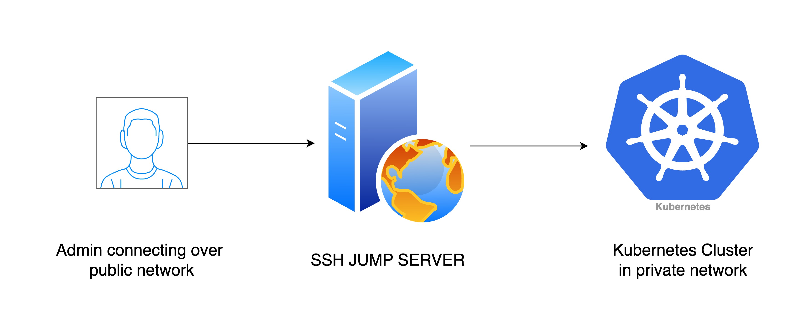

# Setup Access / Jump box

:::info
Skip this step if you have already setup access box. And add it to your network.
:::

## What is an Access Box?

An access box, also known as a jump box, is a secure computer that you can utilize as a stepping stone to access other devices or servers in a separate security zone. The primary purpose of a jump box is to provide a controlled means of access between two dissimilar security zones, enhancing the overall security posture of the network. By funneling all traffic through a single point, it simplifies security management and minimizes the risk of unauthorized access. 

It basically provides a way to connect to our kubernetes cluster using the private network ips.



### 1. Setup using k3s-simplified

In your cluster_config.yaml ensure that you fill in all the other details as required in the final cluster and add the accessBoxConfig field also.

:::warning
Ensure that the node instance type and location you select is in the same region as your other nodes. Because of this [hetzner limitation](https://docs.hetzner.com/cloud/general/locations/#are-there-any-restrictions).
:::

```yaml
hetzner_token: <token>
cluster_name: test-k3s
kubeconfig_path: "./kubeconfig"
k3s_version: v1.29.2+k3s1
public_ssh_key_path: "~/.ssh/hetzner_rsa.pub"
private_ssh_key_path: "~/.ssh/hetzner_rsa"
# ... other config items
// highlight-start
accessBoxConfig:
  node:
    instance_type: cax21
    location: nbg1
    image: 103908130
// highlight-end
```

:::info
Currently only ubuntu 22.04 based access-box can be created, because the installation scripts are only supported for it. For other env please create your own access box or please help in contributing.
:::

### 2. Run the command to create the access box

```bash
k3s-simplified create-access-box --config cluster_config.yaml
```

It will give you the output of the ip to connect to. And then you can install your k3s-cluster from inside the jump-box


### Conclusion

Setting up a jump box is a critical step in securing your network infrastructure. It acts as a controlled entry point, reducing the attack surface and providing a centralized location for security monitoring and logging. Proper configuration and regular maintenance of the jump box are essential to maintain its effectiveness as a security tool.